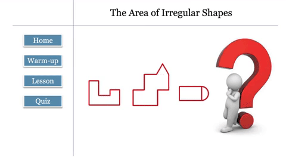

# Educational Aid Application

A user-interactive application aimed to help kids develope a deeper understanding of math problems.

The purpose of the program is to teach grade 6 students how to calculate the area of irregular shapes and reinforce their knowledge. The program is divided into three parts: warm-up, lesson and the quiz. The objective is to get students to be involved in the lesson as well as stimulate their interests in learning and exploring math.
